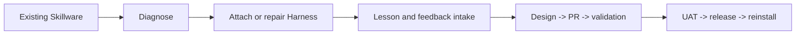

<h1 align="center">EvoZeus-CoEvolve</h1>

<p align="center"><strong>A governed evolution Harness for existing Skillware.</strong></p>

<p align="center">
  <a href="https://github.com/MetaInFLow/EvoZeus-CoEvolve/actions/workflows/ci.yml"></a>
  <a href="https://github.com/MetaInFLow/EvoZeus-CoEvolve/releases/latest"></a>
  <a href="LICENSE"></a>
</p>

<p align="center">
  Part of <a href="https://github.com/MetaInFLow/EvoZeus"><strong>EvoZeus</strong></a> ·
  <a href="#quick-start">Quick Start</a> · <a href="docs/harness-contract.md">Harness Contract</a> ·
  <a href="research/collaborative-evolution/README.md">Research Artifact</a>
</p>

EvoZeus-CoEvolve adds a reviewable, releasable, and recoverable lifecycle to an existing Skill, runtime kit, or plugin-controlled Skill bundle. The target keeps its own task logic and repository workflow; CoEvolve supplies diagnosis, Lesson intake, versioned Harness files, UAT/release gates, and upgrade recovery.



## Table of contents

- [Quick start](#quick-start)
- [What CoEvolve owns](#what-coevolve-owns)
- [Lifecycle](#lifecycle)
- [Harness modes](#harness-modes)
- [Repository layout](#repository-layout)
- [Research artifact](#research-artifact)
- [Development](#development)
- [License](#license)

## Quick start

EvoZeus is the normal user entry. Inspect an attached target first:

```console
$ ~/.evozeus/bin/evozeus coevolve status \
    --target /absolute/path/to/skill \
    --json
```

Plan attachment through the product router:

```console
$ ~/.evozeus/bin/evozeus coevolve attach \
    --target /absolute/path/to/skill \
    --json
```

For repository-level diagnosis, run the Harness directly:

```console
$ python3 scripts/evozeus_wrapper.py skill diagnose \
    --target /absolute/path/to/skill \
    --repo OWNER/REPO \
    --json
```

Diagnosis and dry-run commands do not modify the target. Transform, publish, hook, and bulk-upgrade operations require a separate explicit approval.

## What CoEvolve owns

| Capability | Outcome |
| --- | --- |
| Target diagnosis | Detects the Skill entry, source contract, repository, release, and current Harness state |
| Evolution surface diagnosis | Selects the instruction surface that actually controls runtime behavior |
| Lesson intake | Converts user feedback into a local, reviewable candidate before external writes |
| Governed change flow | Connects Feedback Issue, design, PR, tests, CHANGELOG, UAT, and release |
| Harness maintenance | Checks versions, migrates layouts, upgrades one target or all authorized targets |
| Publish and reinstall | Preserves the canonical source and reconciles runtime pointers |
| User-visible notices | Renders configurable Lesson, Evolution, Maintenance, UAT, Release, Advisory, and Blocked notices |

CoEvolve does not rewrite a target Skill's business rules by default. Raw private sessions, customer material, secrets, and unredacted evidence stay outside this public repository.

## Lifecycle

```text
Feedback -> Local Lesson -> User confirmation -> Issue -> Design -> PR
         -> Validation -> Single UAT -> Release -> Reinstall -> Observe
```

The operating entry is [`skills/using-evozeus-wrapper/SKILL.md`](skills/using-evozeus-wrapper/SKILL.md). It routes work to the stage-specific Skills for environment diagnosis, target diagnosis, evolution-surface diagnosis, status assessment, transformation, publishing, evolution loops, and Harness upgrades.

Useful direct commands:

```console
$ python3 scripts/evozeus_wrapper.py --help
$ python3 scripts/evozeus_wrapper.py skill transform --help
$ python3 scripts/evozeus_wrapper.py loop --help
$ python3 scripts/evozeus_wrapper.py harness upgrade-all --help
$ python3 scripts/evozeus_notice.py --help
```

## Harness modes

| Mode | Target writes | Intended use |
| --- | --- | --- |
| `external-sidecar` | Zero target-owned byte changes | Runtime-managed attachment and contract verification |
| Consolidated target Harness | Incremental managed files under the target's EvoZeus directory | Existing wrapped Skills that require local lifecycle entry |
| Legacy scattered layout | Migration source only | Detected and upgraded through a reviewed migration plan |

The versioned contract bundle lives in [`contracts/v1/`](contracts/v1/). Compatibility identifiers such as `.evozeus-wrapper/`, `evozeus_wrapper.py`, and `EVOZEUS_WRAPPER_*` remain stable for previously attached Skills.

## Repository layout

```text
SKILL.md                         # Thin product entry
skills/                          # Stage-specific operating Skills
scripts/                         # Lifecycle, notice, hook, and preflight CLIs
contracts/v1/                    # Versioned sidecar contract bundle
templates/target/                # Incremental target Harness templates
research/collaborative-evolution # Paper artifact and public evidence
tests/                           # Lifecycle, contract, and artifact tests
```

## Research artifact

**EvoZeus-CoEvolve: An Add-On Harness for Collaborative Evolution of Existing Skillware**

- Authors: Haodi Fan and Zucong Lan, MetaInFlow
- Foundation: [Skillware, arXiv:2607.18970](https://arxiv.org/abs/2607.18970)
- Claims and evidence: [`research/collaborative-evolution/`](research/collaborative-evolution/)
- First public feasibility case: [Engineering Everything](research/collaborative-evolution/examples/engineering-everything/)

The published evidence supports attachment and governed-lifecycle feasibility. Cross-user aggregation, frontier adapters, automatic candidate generation, and comparative effectiveness remain research work until separately validated.

## Development

```console
$ python3 -m unittest discover -s tests -v
$ python3 scripts/evozeus_notice.py render --help
$ git diff --check
```

Changes must preserve the target's original content, remain reversible, and keep public artifacts free of private material. See [AGENTS.md](AGENTS.md) and [CHANGELOG.md](CHANGELOG.md).

## License

EvoZeus-CoEvolve is available under the [MIT License](LICENSE).
